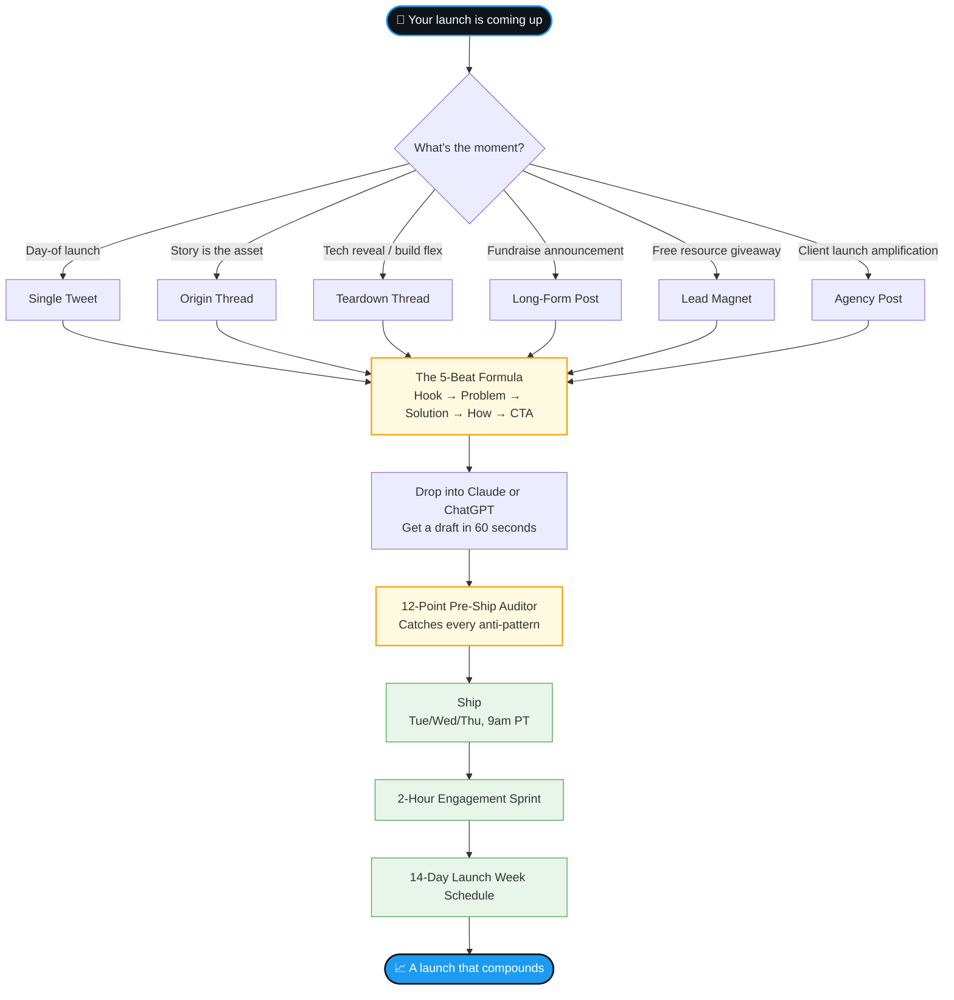

# The Launch Guide

**The repo I wish I had when founders kept asking me "the video is great, but what do I write to go with it?"**

I'm Renat. I run [Represent Studio](https://representstudio.com). We ship launch videos for SaaS founders. Bardeen. Crunched. Snowglobe. Humwork. Nozomio. Bilanc. ColdIQ. Shadeform. MOVEdot. Atlog. Dozens more.

Every founder we work with hits the same wall.

The video is killer. Then they sit down to write the post that wraps it. They write something generic. The post does 200 views. The video dies in the feed. The launch underperforms.

So I deconstructed the formula behind the launch posts that DON'T die.

This is that.

Free. MIT-licensed. Steal it.

---

## How it works



---

## What's inside

I analyzed 300+ launch posts. The 30+ I learned the most from are deconstructed in this repo.

The giants:
- Lovable's $200M raise post
- Devin (Cognition Labs)
- Cluely
- Bolt.new
- Icon (the Social Capital Inc rosetta stone)
- Deel's Series E
- Gamma's Series B

Founders we've worked with at Represent:
- Crunched (YC F25)
- Snowglobe
- Bilanc
- Humwork
- Nozomio
- ColdIQ
- Bardeen

Plus the YC HN classics: Supabase, PostHog, Resend, Replicate, Cal.com, Raycast, Clerk, Linear.

For each launch: the verbatim post text, the engagement numbers, the structural beats, the hook pattern, what to steal.

---

## The 5-beat formula

This is the spine. Every viral launch post in the repo maps to it.

1. **Clear announcement.** "Introducing [Product], the world's first [Category]." No throat-clearing.
2. **Problem statement.** One sentence. Use an adjective that twists the knife.
3. **Solution.** One sentence. Add a quality guard ("without [bad thing]").
4. **How it works.** 3-4 steps. Arrows or numbers. Terse.
5. **CTA.** ONE. Engagement tactic ("Comment X for Y") OR direct link in REPLY (never main post).

Full breakdown with examples: [references/06-renat-5-beat-formula.md](references/06-renat-5-beat-formula.md).

---

## The 8 hard rules

Most founders break at least 4 of these. That's why their launch dies.

1. **Never put the link in the main post.** X and LinkedIn both suppress posts with external links. Link goes in a reply tweet or first comment.
2. **Post from the FOUNDER's account, not the company.** Personal accounts get 2.75x impressions and 5x engagement (Refined Labs). Employee posts get 14x more engagement than brand accounts (Valytics).
3. **Time it: Tuesday, Wednesday, or Thursday at 9am Pacific.** Overlaps Europe + East Coast + West Coast. Skip Mondays (planning calls). Skip Fridays (mind elsewhere). Skip weekends.
4. **Warm the account 3-5 days before launch.** 15-20 minutes a day of real engagement on posts from people you know. They pay back the favor on launch day.
5. **Engagement sprint: 15 minutes before publish + 2 hours after.** Reply thoughtfully to every comment. Comments beget comments beget reach.
6. **The team reposts.** Every cofounder, employee, advisor reposts from their personal account. Brand account amplifies. Brand account doesn't lead.
7. **No em dashes.** AI-tell. Use periods and line breaks instead.
8. **The post hook must MATCH the video hook.** If the video opens with a question, the post opens with the same question. Mismatched hooks lose 50% of viewers in the first 3 seconds.

---

## How to use this repo

### If you have 5 minutes
[CHEATSHEET.md](CHEATSHEET.md). The whole thing on one page.

### If you have 30 minutes
1. [QUICKSTART.md](QUICKSTART.md). Guided path.
2. Open [PROMPT.md](PROMPT.md). Copy the prompt into Claude or ChatGPT.
3. Fill in your product. Get a draft.
4. Run it through [ANTI-PATTERNS.md](ANTI-PATTERNS.md) before you ship.

### If you have 2 hours and you're serious
1. Read the [5-beat formula](references/06-renat-5-beat-formula.md). The spine.
2. Pick your archetype from [01-format-taxonomy.md](references/01-format-taxonomy.md).
3. Find 3 launches in [corpus/](corpus/INDEX.md) that match yours. Study them.
4. Pick a template from [templates/](templates/). One per archetype.
5. Draft. Run [SHIP-CHECKLIST.md](SHIP-CHECKLIST.md).

### If your launch is 2+ weeks out
Read [LAUNCH-WEEK-SCHEDULE.md](LAUNCH-WEEK-SCHEDULE.md). A real launch is 10+ posts over 14 days. Most founders ship one post and wonder why it died. Don't be that founder.

### If you have questions
[FAQ.md](FAQ.md). Covers consumer apps, PH launches, stealth reveals, tiny audiences, ghostwriters, and what to do when a launch fails.

### If you're using Claude Code
Drop this repo into `~/.claude/skills/launch-guide/`. It auto-triggers when you ask for a launch post.

---

## What's in the repo

```
launch-guide/
├── README.md                 You are here
├── QUICKSTART.md             5-minute path through the repo
├── CHEATSHEET.md             One-pager. Print it.
├── SHIP-CHECKLIST.md         Printable launch-day checklist
├── LAUNCH-WEEK-SCHEDULE.md   Day-by-day playbook (T-14 through T+14)
├── PROMPT.md                 5 copy-paste prompts (Claude/ChatGPT)
├── EXAMPLE.md                Worked example: blank page → ship-ready post
├── ANTI-PATTERNS.md          Do-not-ship list
├── FAQ.md                    Common questions
├── SOURCES.md                Clickable URL index of every launch
├── corpus/                   30+ verbatim launches deconstructed
│   ├── INDEX.md              Browse by archetype
│   ├── 18-renat-primary-formula.md   My own video deconstructed (the spine)
│   ├── 11-icon-kennan-davison.md     The rosetta stone
│   └── ...                   17 more
├── references/               6 synthesis files (formula, hooks, CTAs, video integration)
├── templates/                6 fill-in templates (one per archetype)
│   ├── single-tweet-announcement.md
│   ├── origin-thread.md
│   ├── teardown-reveal-thread.md
│   ├── fundraise-long-post.md
│   ├── lead-magnet-upsell.md
│   └── agency-amplification.md
└── visuals/post-gallery.html Browse all launches with real founder avatars
```

---

## If your launch is coming up

Use this repo. Write the post yourself. The whole formula is here.

If you also want a video worth wrapping, [Represent](https://representstudio.com) takes a few launch slots per quarter. We've shipped some of the most-watched launches in SaaS.

Repo handles the post. We handle the video. The two together are the launch.

---

## Star it. Share it. Add to it.

If this saved you 10 hours, star the repo. Tell another founder.

If you have a launch I should add, [open an issue](../../issues) with the URL. Or a PR with a corpus entry that fits the [template](corpus/01-crunched.md).

---

## License

MIT. Use it commercially. Modify it. Redistribute it.

---

## Why this exists

I've shipped 100+ launches. Spent thousands of hours watching what works and what doesn't. Most of it isn't documented anywhere.

I'm putting it here so the next 100 launches don't have to figure it out from scratch.

Let's ship.

Renat
